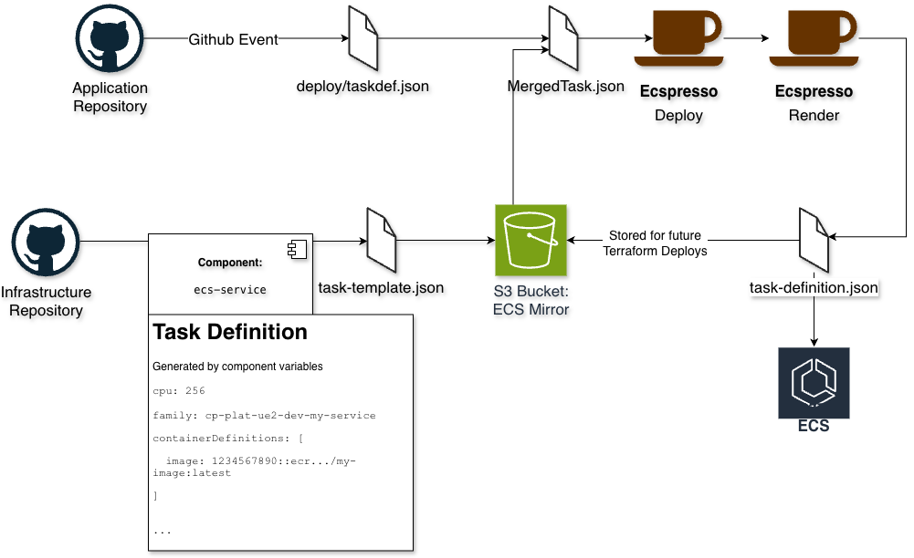

# ECS Partial Task Definitions

This document describes what partial task definitions are and how we can use them to set up ECS services using Terraform
and GitHub Actions.

## The Problem

Managing ECS Services is challenging. Ideally, we want our services to be managed by Terraform so everything is living
in code. However, we also want to update the task definition via GitOps as through the GitHub release lifecycle. This is
challenging because Terraform can create the task definition, but if updated by the application repository, the task
definition will be out of sync with the Terraform state.

Managing it entirely through Terraform means we cannot easily update the newly built image by the application repository
unless we directly commit to the infrastructure repository, which is not ideal.

Managing it entirely through the application repository means we cannot codify the infrastructure and have to hardcode
ARNs, secrets, and other infrastructure-specific configurations.

## Introduction

ECS Partial task definitions is the idea of breaking the task definition into smaller parts. This allows for easier
management of the task definition and makes it easier to update the task definition.

We do this by setting up Terraform to manage a portion of the task definition, and the application repository to manage
another portion.

The Terraform (infrastructure) portion is created first. It will create an ECS Service in ECS, and then upload the task
definition JSON to S3 as `task-template.json`.The application repository will have a `task-definition.json` git
controlled, during the development lifecycle, the application repository will download the task definition from S3,
merge the task definitions, then update the ECS Service with the new task definition. Finally, GitHub actions will
update the S3 bucket with the deployed task definition under `task-definition.json`. If Terraform is planned again, it
will use the new task definition as the base for the next deployment, thus not resetting the image or application
configuration.



### Pros

The **benefit** to using this approach is that we can manage the task definition portion in Terraform with the
infrastructure, meaning secrets, volumes, and other ARNs can be managed in Terraform. If a filesystem ID updates we can
re-apply Terraform to update the task definition with the new filesystem ID. The application repository can manage the
container definitions, environment variables, and other application-specific configurations. This allows developers who
are closer to the application to quickly update the environment variables or other configuration.

### Cons

The drawback to this approach is that it is more complex than managing the task definition entirely in Terraform or the
application repository. It requires more setup and more moving parts. It can be confusing for a developer who is not
familiar with the setup to understand how the task definition is being managed and deployed.

This also means that when something goes wrong, it becomes harder to troubleshoot as there are more moving parts.

### Getting Setup

#### Pre-requisites

- Application Repository - [Cloud Posse Example ECS Application](https://github.com/cloudposse-examples/app-on-ecs)
- Infrastructure Repository
- ECS Cluster - [Cloud Posse Docs](https://docs.cloudposse.com/components/library/aws/ecs/) -
  [Component](https://github.com/cloudposse/Terraform-aws-components/tree/main/modules/ecs).
- `ecs-service` - [Cloud Posse Docs](https://docs.cloudposse.com/components/library/aws/ecs-service/) -
  [Component](https://github.com/cloudposse/Terraform-aws-components/tree/main/modules/ecs-service).
  - **Must** use the Cloud Posse Component.
  - [`v1.416.0`](https://github.com/cloudposse/Terraform-aws-components/releases/tag/1.416.0) or later.
- S3 Bucket - [Cloud Posse Docs](https://docs.cloudposse.com/components/library/aws/s3-bucket/) -
  [Component](https://github.com/cloudposse/Terraform-aws-components/tree/main/modules/s3-bucket).

#### Steps

1. Set up the S3 Bucket that will store the task definition.

   <br/>This bucket should be in the same account as the ECS Cluster.

   <br/>
   <details>
   <summary>S3 Bucket Default Definition</summary>

   ```yaml
   components:
     terraform:
       s3-bucket/defaults:
         metadata:
           type: abstract
         vars:
           enabled: true
           account_map_tenant_name: core
           # Suggested configuration for all buckets
           user_enabled: false
           acl: "private"
           grants: null
           force_destroy: false
           versioning_enabled: false
           allow_encrypted_uploads_only: true
           block_public_acls: true
           block_public_policy: true
           ignore_public_acls: true
           restrict_public_buckets: true
           allow_ssl_requests_only: true
           lifecycle_configuration_rules:
             - id: default
               enabled: true
               abort_incomplete_multipart_upload_days: 90
               filter_and:
                 prefix: ""
                 tags: {}
               # Move to Glacier after 2 years
               transition:
                 - storage_class: GLACIER
                   days: 730
               # Never expire
               expiration: {}
               # Versioning isnt enabled, but these default values are still required
               noncurrent_version_transition:
                 - storage_class: GLACIER
                   days: 90
               noncurrent_version_expiration: {}
   ```

   </details>

   ```yaml
   import:
     - catalog/s3-bucket/defaults

   components:
     Terraform:
       s3-bucket/ecs-tasks-mirror: #NOTE this is the component instance name.
         metadata:
           component: s3-bucket
           inherits:
             - s3-bucket/defaults
         vars:
           enabled: true
           name: ecs-tasks-mirror
   ```

2. Create an ECS Service in Terraform

   <br/>Set up the ECS Service in Terraform using the
   [`ecs-service` component](https://github.com/cloudposse/Terraform-aws-components/tree/main/modules/ecs-service). This
   will create the ECS Service and upload the task definition to the S3 bucket.

   <br/>To enable Partial Task Definitions, set the variable `s3_mirror_name` to be the component instance name of the
   bucket to mirror to. For example `s3-bucket/ecs-tasks-mirror`

   ```yaml
   components:
     Terraform:
       ecs-services/defaults:
         metadata:
           component: ecs-service
           type: abstract
         vars:
           enabled: true
           ecs_cluster_name: "ecs/cluster"
           s3_mirror_name: s3-bucket/ecs-tasks-mirror
   ```

3. Set up an Application repository with GitHub workflows.

   An example application repository can be found [here](https://github.com/cloudposse-examples/app-on-ecs).

   <br/> Two things need to be pulled from this repository:

   - The `task-definition.json` file under `deploy/task-definition.json`
   - The GitHub Workflows.

   An important note about the GitHub Workflows, in the example repository they all live under `.github/workflows`. This
   is done so development of workflows can be fast, however we recommend moving the shared workflows to a separate
   repository and calling them from the application repository. The application repository should only contain the
   workflows `main-branch.yaml`, `release.yaml` and `feature-branch.yml`.

   <br/>To enable Partial Task Definitions in the workflows, the call to
   [`cloudposse/github-action-run-ecspresso` (link)](https://github.com/cloudposse-examples/app-on-ecs/blob/main/.github/workflows/workflow-cd-ecspresso.yml#L133-L147)
   should have the input `mirror_to_s3_bucket` set to the S3 bucket name. the variable `use_partial_taskdefinition`
   should be set to `'true'`

   <details>
   <summary> Example GitHub Action Step </summary>

   ```yaml
   - name: Deploy
     uses: cloudposse/github-action-deploy-ecspresso@0.6.0
     continue-on-error: true
     if: ${{ steps.db_migrate.outcome != 'failure' }}
     id: deploy
     with:
       image: ${{ steps.image.outputs.out }}
       image-tag: ${{ inputs.tag }}
       region: ${{ steps.environment.outputs.region }}
       operation: deploy
       debug: false
       cluster: ${{ steps.environment.outputs.cluster }}
       application: ${{ steps.environment.outputs.name }}
       taskdef-path: ${{ inputs.path }}
       mirror_to_s3_bucket: ${{ steps.environment.outputs.s3-bucket }}
       use_partial_taskdefinition: "true"
       timeout: 10m
   ```

   </details>

## Operation

Changes through Terraform will not immediately be reflected in the ECS Service. This is because the task template has
been updated, but whatever was in the `task-definition.json` file in the S3 bucket will be used for deployment.

To update the ECS Service after updating the Terraform for it, you must deploy through GitHub Actions. This will then
download the new template and create a new updated `task-defintion.json` to store in s3.
