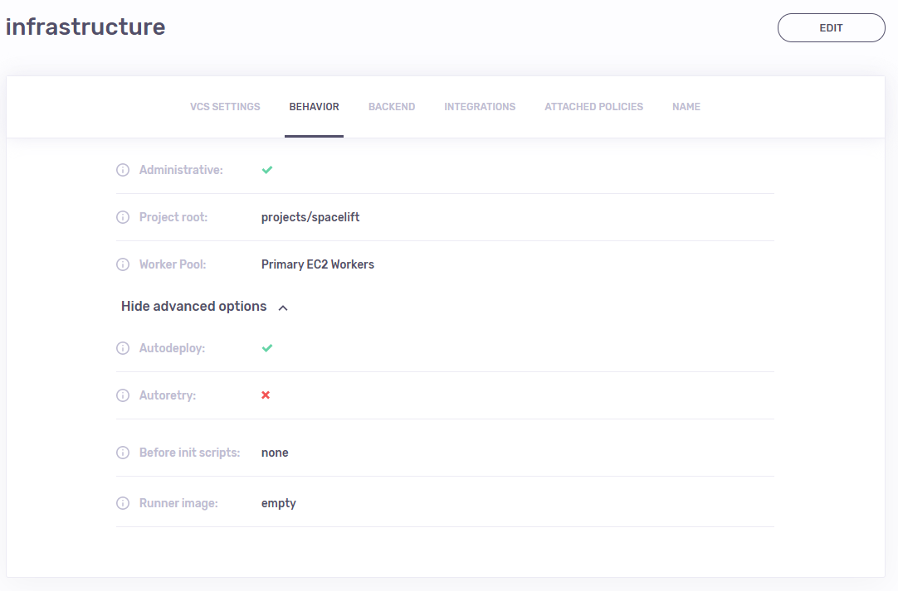
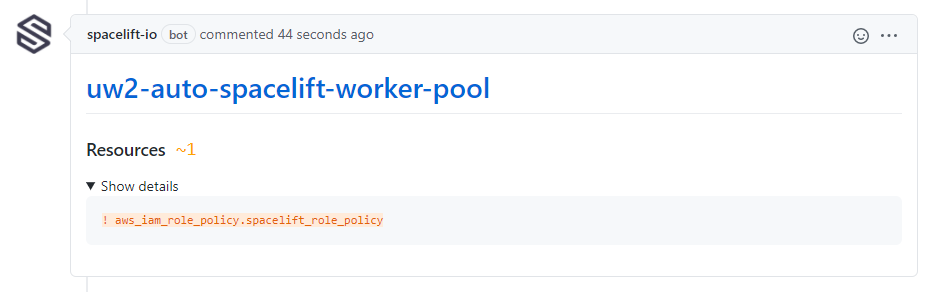
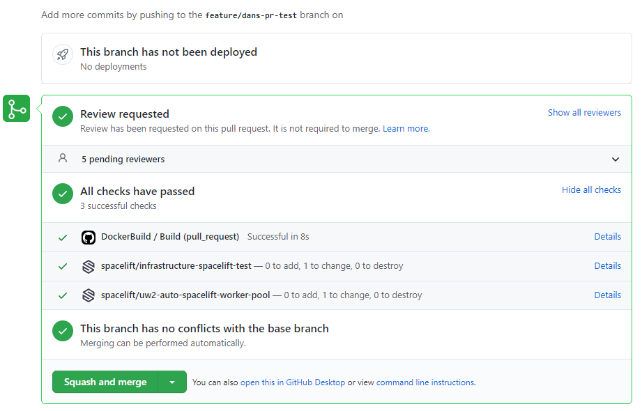
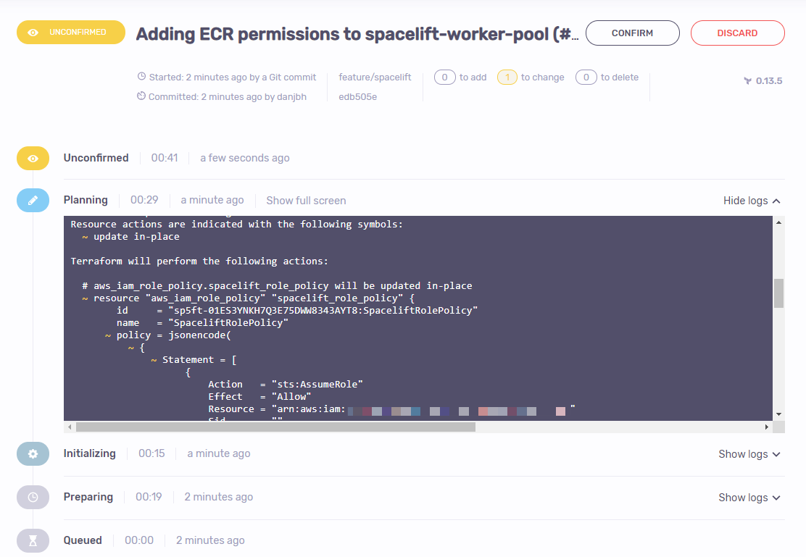

# Spacelift

Spacelift is a specialized, Terraform-compatible continuous integration and deployment (CI/CD) platform for infra-as-code. It's designed and implemented by long-time DevOps practitioners based on previous experience with large-scale installations - dozens of teams, hundreds of engineers and tens of thousands of cloud resources.​

## Projects & Configuration

​There are two projects located in this repository that are required for the deployment & day-to-day operation of Spacelift.
​
| Project                 | Description                                            |
|-------------------------|--------------------------------------------------------|
| `spacelift-worker-pool` | Deploys Spacelift workers to EC2                       |
| `spacelift`             | Creates & manages all Spacelift stacks & configuration |
​
The `spacelift` project relies on stack configurations, which you read more about here: https://docs.cloudposse.com/reference/stacks

## Bootstrapping

After creating & linking Spacelift to this infrastructure repo (see the [docs](https://docs.spacelift.io/integrations/github)), follow these steps...

### Deploying the custom Spacelift worker pool

Before any Terraform stacks can be executed from Spacelift, a custom worker pool must be deployed to AWS EC2. To do so, please follow
the steps outlined in the `spacelift-worker-pool` project [README](../components/terraform/spacelift-worker-pool/README.md).

### Creating the top-level Spacelift project

1. Set the branch to the mainline branch (e.g. `master`, `main` or `production`)
2. Set the `Project root` to `components/terraform/spacelift`
3. Associate the Spacelift worker pool created in the previous section
4. Enable `Administrative` access for the stack
5. Enable `Autodeploy` (under `Behavior` - `Advanced Options`)
6. Set the Terraform version to at least `0.13.5` (under `Backend`)
7. Finally, trigger the stack, which will complete the configuration!
   ​
   

## Pull Request Workflow

1. Create a new branch & make changes
2. Create a new pull request (targeting the mainline branch)
3. View the modified resources directly in the pull request

   

4. View the successful Spacelift checks in the pull request

   

5. Merge the pull request and check the Spacelift job

   
   ​
   **NOTE**: This job is not set to `autodeploy` and requires manual confirmation before applying.
